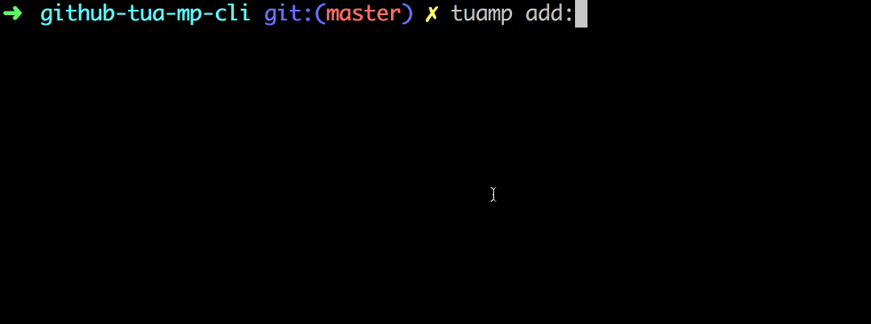
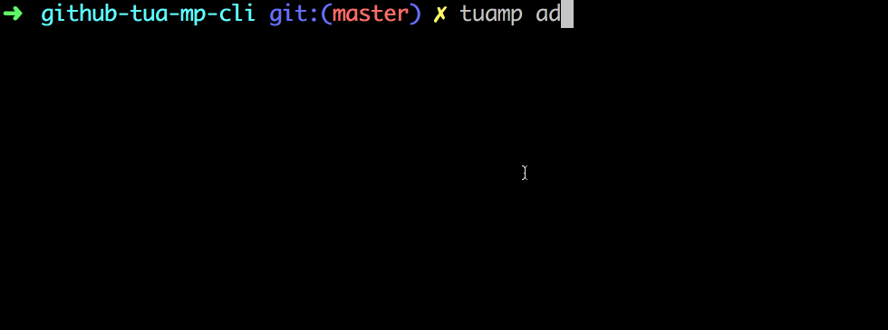

<h1 align="center">@tua-mp/cli</h1>

<p align="center">
    <a href="https://github.com/feross/standard"></a>
</p>

## 0.介绍
这个包为 [tua-mp](https://github.com/tuateam/tua-mp) 提供了一些方便的命令，可以用于一键生成项目、创建页面、创建组件、创建 api 等功能。

## 1.安装

```bash
$ npm i -g @tua-mp/cli
# OR
$ yarn add global @tua-mp/cli
```

## 2.使用
### 2.1.初始化项目 `init`
这个命令代理了 vue-cli v2，所以用法也一样...

```bash
$ tuamp init <template-name> <project-name>
```

### 2.2.添加接口命令 `add:api`
这个命令将添加一个新文件 `<name>.js` 到 `src/apis/` 下，并且自动添加到 `src/apis/index.js` 中导出。

```bash
# 添加小程序端 api
$ tuamp add:api <name>
```


该命令会自动在 `src/apis/index.js` 中导出该 `api`，例如 `<name>` 为 `foo-bar`，那么导出的接口名称为 `fooBarApi`（已转成小驼峰，并在结尾加上 `Api`）。

### 2.3.添加页面命令 `add:page`
这个命令将添加一个新文件夹 `<name>` 到 `src/pages/` 下，并且自动添加 `pages/<name>/<name>` 到 `src/app/app.json` 中。

并且如果页面以**连字符**命名，那么相关的 `.vue` 文件会被转成**大驼峰**风格。

```
└─ pages
   ├─ ...
   └─ a-b           // 连字符
      ├─ AB.vue     // 大驼峰
      └─ index.js
```

```bash
# 添加小程序端 page
$ tuamp add:page <name>
```


该命令会自动读取 `src/app/app.json` 中的 `pages` 字段，并将新页面加入。

### 2.4.添加页面命令 `add:comp`
由于组件一般分为两种：

* 全局组件（位于 `src/comps/` 下）
* 页面组件（位于 `src/pages/foo-bar/comps/` 下）

所以这个命令有两种用法，添加可选的 `-g, --global` 参数表示添加全局组件，将添加一个新文件夹 `<name>` 到 `src/comps/` 下，否则会进行交互式询问模板文件夹的路径。

组件建议都使用**大驼峰**命名风格

```
└─ comps
   ├─ ...
   └─ TuaImage          // 大驼峰
      ├─ TuaImage.vue   // 大驼峰
      └─ index.js
```

```bash
# 全局添加小程序端 comp(-g, --global)
$ tuamp add:comp -g <name>
```



```
# 局部添加小程序端 comp
$ tuamp add:comp <name>
```


